# climbing_web_app_bolt

クライミング動画解析・トレーニング管理プラットフォーム ― **AI Climbing Tokyo** のソースコードです。最新機能（フル動画＋範囲指定分析）、多言語化、モバイル最適化、HTTP/2 対応など、全ての変更を統合した最新版 README です。

---

## 目次

1. 概要
2. システム全体像
3. フォルダ構成
4. 技術スタック
5. セットアップ & ローカル開発
6. 環境変数 / シークレット
7. デプロイ（GCP Cloud Run / Netlify）
8. トラブルシューティング & 予防策
9. 今後想定されるバグと対策
10. 変更履歴（ハイライト）

---

## 1. 概要 ⭐

- クライミングの **動画アップロード → AI 解析 → アドバイス生成** を行う Web アプリ。
- **フル動画(≤30 s) + 範囲指定(≤3 s)**、**従来 5 s 動画** の 2 モードに対応。
- React + TypeScript + TailwindCSS（フロント）/ FastAPI + Hypercorn（バックエンド）。
- GCS、ChromaDB、Gemini AI、OpenAI API と連携。
- Multi-region Cloud Run（HTTP/2）・Netlify CDN で高速配信。

---

## 2. システム全体像 🌐

```mermaid
flowchart TD
  subgraph ブラウザ/モバイル
    A[ユーザー]
  end
  subgraph Frontend[Netlify / Vite SPA]
    B[React App]
  end
  subgraph CloudRun[Cloud Run : FastAPI + Hypercorn]
    C[FastAPI アプリ]
    C -->|アップロード| GCS[(GCS<br/>climbing-videos-bucket)]
    C -->|チャット補助| CHROMA[(ChromaDB)]
    C -->|Gemini 呼び出し| GEMINI[(Google Gemini API)]
    C -->|Fallback| OPENAI[(OpenAI API)]
  end
  A -->|HTTP/HTTPS| B
  B -->|REST / HTTP2| C
  C -->|署名付 URL| B
```

### CI/CD & サービス連携フロー 🚀

```
            +-----------+                  +-----------------+
            | Developer |  git push       |   GitHub        |
            +-----------+ --------------->+  Repository     |
                                             +--------------+
                                                    | trigger
                                                    v
            +-----------+  build/pack   +-----------------+
            | Secret    |-------------->|   Cloud Build   |
            | Manager   |   inject      +-----------------+
            +-----------+                      |
                                               v  docker image
                                         +-----------------+
                                         | Artifact        |
                                         | Registry        |
                                         +-----------------+
                                               |
                                               v  deploy
                                         +-----------------+
                                         |  Cloud Run      |
                                         |  (FastAPI)      |
                                         +-----------------+
                                               |
                             REST API & signed URL |
                                               v
             +---------+   HTTPS   +-----------------+
             |  SPA    |<--------- |  End Users      |
             |(Netlify)|           +-----------------+
             +---------+  serve static assets
                    ^
                    |
        build -> +-----------------+
                 |   Netlify CI    |
                 +-----------------+
```

### ユーザーフロー（インプット → アウトプット） 🧗‍♂️

```
   [1] ブラウザでサイトを開く
           |
           v
   +-------------------+
   | React SPA (Top)  |
   +-------------------+
           |
           | ① モード選択 (5秒 / フル動画)
           v
   +-------------------+
   | Video Uploader    |
   +-------------------+
           |
           | ② 動画ドラッグ & ドロップ
           v                 プログレスバー表示
   +-------------------+    <===============+
   |  FormData POST    |                     |
   |  /upload* API     |---------------------+
   +-------------------+    ③ GCSへストリーム保存
           |                           |
           |HTTP/2 JSON                |
           v                           |
   +-------------------+               |
   |  upload 返却値   |  gcsBlobName   |
   +-------------------+               |
           |                           |
           | ④ /analyze* API 呼び出し  |
           v                           |
   +-------------------+               |
   | FastAPI backend   |---------------+
   +-------------------+
           |
           | ⑤ FFmpeg 範囲切出し (必要時)
           |
           | ⑥ Gemini + Chroma 推論
           v
   +-------------------+
   |  JSON Response    | <--- 問題点, アドバイス, 参照元
   +-------------------+
           |
           | ⑦ Frontend 受信
           v
   +-------------------+
   | AnalysisResult    |
   |  (UI 表示)        |
   +-------------------+
           |
           | ⑧ ユーザーに結果 & ソース提示
           v
   [2] 改善ポイントを理解して再トライ！
```

---

## 3. フォルダ構成 📁

```mermaid
journey
  title Project Folder Flow
  section Root
    src        : UI / Hooks / API サービス
    gcp_config : Dockerfile / Cloud Build / Infra
    public     : 静的アセット & リダイレクト
    rewrite    : 仕様書・設計ドキュメント
    bk_main.py : バックアップスクリプト
```



<details>
<summary>主要サブディレクトリ</summary>

| パス              | 主な内容                                                            |
| ----------------- | ------------------------------------------------------------------- |
| `src/components`  | React UI コンポーネント群                                           |
| `src/api`         | axios ラッパー / 型安全 API コール                                  |
| `src/i18n`        | i18next 設定 & 翻訳ファイル                                         |
| `gcp_config`      | Cloud Run デプロイ関連（Dockerfile, cloudbuild.yaml, main.py など） |
| `public/redirect` | Instagram UTM 付きリダイレクトページ                                |
| `rewrite/`        | 要件定義・技術メモ・改善案                                          |

</details>

---

## 4. 技術スタック 🛠️

| レイヤ         | 技術                                                                                 | 補足                    |
| -------------- | ------------------------------------------------------------------------------------ | ----------------------- |
| フロントエンド | React 18, TypeScript 5, Vite 5, TailwindCSS 3, i18next, lucide-react, react-toastify | PWA & SEO 最適化済み    |
| バックエンド   | FastAPI, Hypercorn(ASGI) + HTTP/2, Pydantic v2                                       | FFmpeg による動画最適化 |
| AI / DB        | Google Gemini Pro, OpenAI GPT-4o (バックアップ), ChromaDB + LangChain                | ベクトル検索            |
| インフラ       | Google Cloud Run, Artifact Registry, Cloud Build, Google Cloud Storage               | Asia-Northeast1         |
| CI/CD          | Netlify CLI, GitHub Actions(予定)                                                    | フロント自動デプロイ    |

---

## 5. セットアップ & ローカル開発 🖥️

### 前提

- Node.js ≥ 20 (推奨 24.x)
- Python ≥ 3.11 (バックエンド開発時)
- ffmpeg / ffprobe が PATH に存在

### 手順 (Windows PowerShell 例)

```powershell
# 1) クローン
> git clone https://github.com/Hassan-python/climbing_web_app_bolt.git
> cd climbing_web_app_bolt

# 2) 依存関係
> npm ci         # or pnpm i / yarn

# 3) 開発サーバ
> npm run dev    # localhost:5173 (vite.config.ts で PORT=5173)
```

⚠️ もし `npm` が認識されない場合は環境変数を再ロード:

```powershell
$env:PATH = [System.Environment]::GetEnvironmentVariable('PATH','Machine') + ';' + [System.Environment]::GetEnvironmentVariable('PATH','User')
```

---

## 6. 環境変数 / シークレット 🔑

| 変数               | 用途                                | 例                       | 備考                |
| ------------------ | ----------------------------------- | ------------------------ | ------------------- |
| `GCS_BUCKET_NAME`  | 動画保存用 GCS バケット名           | `climbing-videos-bucket` | Cloud Run 環境必須  |
| `MAX_FILE_SIZE`    | サーバー側ファイルサイズ上限 (byte) | `104857600`              | 100 MB              |
| `MEMORY_LIMIT`     | Hypercorn メモリ制限                | `4096M`                  | 4 GB                |
| `REQUEST_TIMEOUT`  | API タイムアウト (s)                | `900`                    |
| `HTTP2_ENABLED`    | HTTP/2 フラグ                       | `true`                   |
| `PHASE`            | デプロイフェーズ                    | `2`                      | Blue-Green 等に使用 |
| `CHROMA_DB_URL`\*  | ChromaDB 接続 URL                   | `https://...`            | Secret Manager      |
| `GEMINI_API_KEY`\* | Gemini API キー                     | `AIz...`                 | Secret Manager      |
| `OPENAI_API_KEY`\* | GPT-4o キー                         | `sk-...`                 | (fallback)          |

`*` は **Google Secret Manager** を使用し `run services update --update-secrets` で注入します。

---

## 7. デプロイ 🚀

### Cloud Run (Backend)

```bash
cd gcp_config
# Cloud Build でビルド & デプロイ (推奨)
gcloud builds submit --config cloudbuild.yaml --project climbing-application-458609 .

# もしくは PowerShell スクリプト
./deploy-cloudbuild.ps1 -ProjectId climbing-application-458609
```

デプロイ後の確認:

```bash
curl https://climbing-web-app-bolt-aqbqg2qzda-an.a.run.app/chroma-status
# {"status":"✅ ChromaDB(Langchain) 接続成功 ..."}
```

### Netlify (Frontend)

```bash
npm run build
netlify deploy --prod --dir=dist   # PWA & SEO 最適化済み
```

---

## 8. トラブルシューティング & 予防策 🩹

| 症状                              | 原因 / ログ                            | 即時対処                                                                    | 恒久対策                                     |
| --------------------------------- | -------------------------------------- | --------------------------------------------------------------------------- | -------------------------------------------- |
| 500 Internal / GCS not configured | `GCS_BUCKET_NAME` 未設定               | `run services update ... --set-env-vars GCS_BUCKET_NAME=`                   | Cloud Build 完了後の自動スクリプトで必ず設定 |
| Range > 3 s で 400                | 浮動小数点誤差 (`3.00000004`)          | `max_range_duration=3.01` に設定                                            | フロントでも `Math.ceil*100/100` に揃える    |
| `npm` コマンド認識不可 (Win)      | PATH が古い                            | PowerShell を管理者で再起動 & PATH 再ロード                                 | README 手順参照                              |
| Cloud Run 環境変数が 1 行に結合   | `--set-env-vars` を 1 回で複数指定した | 変数毎に個別実行 or `--env-vars-file`                                       | デプロイスクリプトで個別 update              |
| 動画再生できず 404                | GCS URL 不一致 / CORS                  | `/video/{filename}` エンドポイント確認 & allowed_origins に FE ドメイン追加 | HealthCheck シナリオテストを CI で実施       |

---

## 9. 今後想定されるバグと対策 🔮

1. **ChromaDB スキーマ不整合**
   - 想定: ドキュメント構造変更 ➜ embedding 失敗
   - 対策: `load_knowledge.py --replace` を定期実行し、`version` カラムでマイグレーション。
2. **Gemini API RateLimit**
   - 想定: 深夜帯大量アクセス
   - 対策: GPT-4o フォールバックを自動切り替え。`BACKUP_MODEL=gpt-4o` 環境変数を用意。
3. **i18n キー欠落**
   - 想定: 新 UI 追加時に翻訳忘れ
   - 対策: ESLint ルール `no-missing-translation-key` を CI に追加。
4. **モバイル音声無音バグ(iOS)**
   - 想定: `muted` 属性欠落
   - 対策: VideoRangeSelector に `playsInline muted` を強制。
5. **HTTP/2 ALPN ミスマッチ**
   - 想定: Chrome アップデート後 0-RTT 失敗
   - 対策: Hypercorn を `--http2 --tls` へ切替、ALB を経由しない構成を準備。

---

## 10. 変更履歴（ハイライト） 📝

- **2025-06-23** 範囲分析バグ修正 & README 再生成 (本ファイル)
- **2025-06-07** HTTP/2 対応 & ブランド刷新 (PWA/SEO)
- **2025-01-02** フル動画＋範囲指定分析 / 多言語化 / モバイル最適化
- **2024-12-23** ChromaDB 知識ベース完全更新 & Gemini バグ修正
- **2024-12-19** Instagram リダイレクト & UTM 追跡機能

> 詳細な差分・過去の設計資料は `rewrite/` とリリースノート (`20250623_README.md` など) を参照してください。

---

© 2025 AI Climbing Tokyo Team. All rights reserved.
